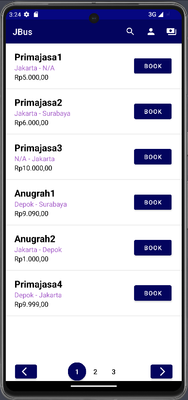
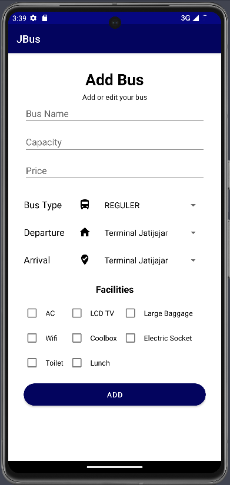

# JBus

JBus is the final project for Object-Oriented Programming Lab. This Android application provides a user-friendly platform for booking bus tickets seamlessly. It is designed to make the process of reserving seats, checking schedules, and managing bookings. This repository is specifically for the front-end part of the JBus android application. To connect to the back-end, the app uses SpringBoot framework. Click [here](https://github.com/auli-aziz/JBus.git) to visit the backend.

* Target SDK    : Android version 33
* Minimum SDK   : Android version 21
## Authors

- [@auli-aziz](https://www.github.com/auli-aziz)

## Requirements

For building and running the application you need:
* [JDK version 11](https://www.oracle.com/java/technologies/javase/jdk11-readme.html)
* Minimum of Java Version 11.0.20

## Additional Dependencies

1. Retrofit Library:
- Group ID: org.springframework.boot
- Version: 2.9.0

3. Gson Converter for Retrofit:
- Group ID: com.squareup.retrofit2:converter-gson
- Version: 2.9.0
## Project Structure

- **src/main/java/com/auliaAnugrahAzizJBusRD/jbus_android/array_adapter:** Contains array adapters to manage list items in list view.
- **src/main/java/com/auliaAnugrahAzizJBusRD/jbus_android/model:** Contains model to handle data fetched from the API service.
- **src/main/java/com/auliaAnugrahAzizJBusRD/jbus_android/request:** Contains API and Retrofit Client to connect to the back-end
- **src/main/java/com/auliaAnugrahAzizJBusRD/:** Contains android activities to display data.

## JBus Activities Preview
### Login

### Register

### Main

### About Me

### Register Renter

### Bus Detail

### Make Booking

### Payment History

### Manage Bus

### Add Bus

### Add Schedule

### Payment Requests

